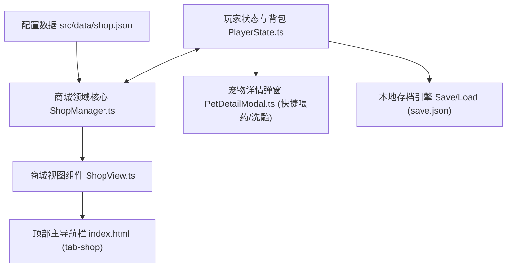
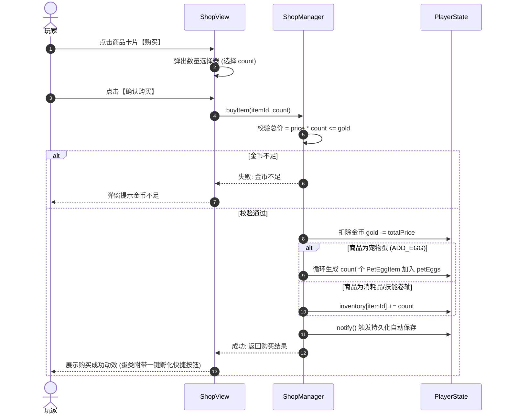

# 幻境商城与背包道具系统设计规范 (In-Game Shop & Inventory System Design)

## 1. 概述与设计背景 (Overview & Goals)

在《御兽神决 · 基因共鸣》中，玩家通过关卡挑战（Stage Battles）积累了大量金币资产（Gold）。为了盘活游戏经济循环，让通关收益能够实时转化为队伍战力，现新增**【🛒 幻境商城】与【背包道具系统】**。

### 核心设计目标
1. **闭环经济消耗**：关卡掉落的金币可用于选购灵宠蛋、成长经验丹、洗髓丹及核心技能卷轴。
2. **多品质灵宠蛋常驻获取**：玩家无需依赖低概率刷关，可直接选购普通至神话级灵宠蛋，为多代基因融合提供稳定胚子库。
3. **加速养成体验**：提供凝灵经验丹（+500 EXP）与真元纯阳丹（+2500 EXP），解决新孵化宠物等级脱节、无法跟上主线推图的痛点。
4. **资质洗炼重生**：提供造化洗髓丹，允许玩家对满意的宠物在其种族区间内重摇成长资质。
5. **极简直观的操作闭环**：支持分类货架浏览、数量步进购买、购蛋后一键直接破壳、背包快速喂养。

---

## 2. 系统架构与模块分工 (Architecture & Components)



### 模块划分
1. **数据配置层 (`src/data/shop.json`)**：静态声明可售货品的元数据（ID、分类、品质、价格、图标、效果描述及数值）。
2. **领域逻辑层 (`src/core/shop/ShopManager.ts`)**：
   - 货品查询与分类过滤；
   - 购买事务控制（金币校验、扣款、入库分发）；
   - 数据变更通知与持久化联动。
3. **玩家状态与背包扩充 (`src/core/player/PlayerState.ts`)**：
   - 新增 `inventory: Record<string, number>` 字段；
   - 物品使用核心逻辑 `useItem(itemId, targetPetId)`；
   - 存档序列化/反序列化完整向下兼容。
4. **表现层 (`src/presentation/components/ShopView.ts`)**：
   - 响应式分类货架（全部/宝蛋/消耗品/秘卷）；
   - 购买确认弹窗与数量调节；
   - 购买后即时破壳/使用弹窗。
5. **集成联动 (`src/main.ts` & `index.html`)**：
   - 注册主导航 Tab，联动界面切换与状态刷新。

---

## 3. 数据契约与接口规范 (Data Contracts)

### 3.1 商品分类与配置结构
```typescript
export type ShopCategory = 'PET_EGGS' | 'CONSUMABLES' | 'SKILL_SCROLLS';

export interface ShopItemConfig {
  id: string;                      // 唯一货品 ID，如 'item_egg_tier4'
  name: string;                    // 商品名称，如 '远古神兽蛋'
  category: ShopCategory;          // 商品类别
  tier: 1 | 2 | 3 | 4;             // 1绿, 2蓝, 3紫, 4金
  price: number;                   // 金币单价
  icon: string;                    // 图标 Emoji
  description: string;             // 详细描述
  effect: {
    type: 'ADD_EGG' | 'ADD_EXP' | 'REROLL_GROWTH' | 'UNLOCK_SKILL';
    eggTier?: 1 | 2 | 3 | 4;       // 针对 ADD_EGG
    expValue?: number;             // 针对 ADD_EXP
    skillId?: string;              // 针对 UNLOCK_SKILL
  };
}
```

### 3.2 货架常驻清单 (`src/data/shop.json`)
| 商品 ID | 名称 | 分类 | 品质 | 售价 (金币) | 核心效果 |
| :--- | :--- | :--- | :--- | :--- | :--- |
| `item_egg_tier1` | 初阶血脉蛋 | PET_EGGS | 1 (普通) | 200 | 孵化 1 阶普通宠物 |
| `item_egg_tier2` | 进阶真灵蛋 | PET_EGGS | 2 (进阶) | 600 | 孵化 2 阶进阶宠物 |
| `item_egg_tier3` | 史诗异兽蛋 | PET_EGGS | 3 (史诗) | 1800 | 孵化 3 阶史诗宠物 |
| `item_egg_tier4` | 远古神话蛋 | PET_EGGS | 4 (神话) | 5000 | 孵化 4 阶神话圣兽 |
| `item_exp_pill_s` | 凝灵经验丹 (小) | CONSUMABLES | 1 (普通) | 100 | 为指定宠物注入 +500 经验 |
| `item_exp_pill_l` | 真元纯阳丹 (大) | CONSUMABLES | 2 (进阶) | 400 | 为指定宠物注入 +2500 经验 |
| `item_wash_pill` | 造化洗髓丹 | CONSUMABLES | 3 (史诗) | 1200 | 重置选定宠物随机成长资质区间 |
| `item_scroll_heal` | 回春术古卷 | SKILL_SCROLLS | 2 (进阶) | 800 | 直接解锁技能【春风拂体/回春术】|

---

## 4. 业务逻辑与处理流程 (Business Logic)

### 4.1 购买结算流程


### 4.2 道具使用规则 (`playerState.useItem`)
1. **经验丹使用 (`ADD_EXP`)**：
   - 目标参数：`targetPetId`。
   - 流程：校验目标宠物是否存在且未满级（当前上限 Lv.50）。
   - 执行：扣减 1 个道具库存，调用宠物增加经验算法，若发生升级，计算成长数值，更新 HP/MP/ATK/DEF/SPD，并返回详细升级报告。
2. **洗髓丹使用 (`REROLL_GROWTH`)**：
   - 目标参数：`targetPetId`。
   - 流程：获取该宠物原生种族配置（Race Growth Ranges）。
   - 执行：扣减 1 个道具库存，重新执行 `rollHatchGrowth(raceRanges)`，更新 `pet.growth`，根据新成长值重算当前等级属性。
3. **异常处理**：道具数量不足、目标宠物不存在、或者宠物已达满级时均返回明确错误消息并不扣除道具。

---

## 5. 持久化与存档兼容 (Persistence & Compatibility)

- 在 `save.json` 结构中扩充：
  ```json
  {
    "gold": 1200,
    "inventory": {
      "item_exp_pill_s": 5,
      "item_wash_pill": 1
    }
  }
  ```
- **向下兼容性保证**：
  在 `PlayerState.loadFromData()` 中，若旧版存档不存在 `inventory` 字段，则安全回退初始化为空对象 `{}`，完全不影响现有用户的旧存档。

---

## 6. 自动化测试策略 (Testing Strategy)

编写独立测试套件 `tests/shop.test.ts`，涵盖以下测试用例：
1. **商品列表过滤**：验证全部商品查询及分类筛选（宝蛋、消耗品、秘卷）。
2. **金币充足购买**：验证正常购买扣款、蛋类入库、消耗品入背包。
3. **金币不足拦截**：金币不足时购买失败，金币与库存保持不变。
4. **批量购买计算**：验证购买多件（count > 1）的总金额与道具发放数量。
5. **经验丹喂养结算**：使用经验丹使宠物获取经验，跨级升级后属性平滑提升。
6. **造化洗髓丹洗炼**：验证宠物资质在种族区间内重新摇点。
7. **数据持久化与回溯**：验证 `save.json` 导出与导入时背包数据的准确性。

---

## 7. 规格自检清单 (Self-Review Checklist)
- [x] **无占位符**：所有道具属性、数值与公式均已具体化。
- [x] **架构一致性**：`ShopManager` 与既有 `PlayerState` 和 `BattleView`、`ClassTalentView` 模式一致。
- [x] **范围受控**：专注商城与行囊闭环，不产生多余分支系统。
- [x] **明确性**：购买、扣款、入库、使用流程均具有确定性。
